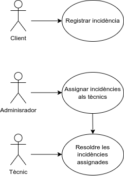
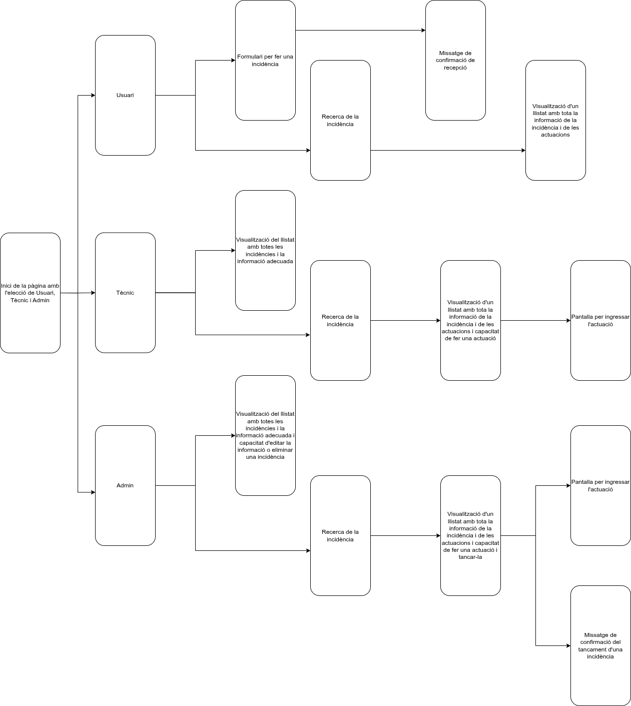

@Author: Jaume Hurtado, Daniel Robles

# SISTEMA PER LA GESTIÓ D'INCIDÈNCIES EN DIFERENTS DEPARTAMENTS D'UNA EMPRESA

## Descripció

Aquest projecte consisteix en el desenvolupament d’un sistema web per a la gestió d’incidències als diferents departaments d’una empresa. Permet registrar, consultar i resoldre incidències de manera eficient, facilitant la comunicació entre els usuaris i els tècnics.

## Funcionalitats

- Registre d’incidències per part dels usuaris anònims.
- Visualització de totes les incidències per part dels administradors.
- Assignació de tècnics i prioritat a cada incidència.
- Visualització de les incidències assignades als tècnics, ordenades per prioritat.
- Possibilitat de marcar incidències com a resoltes.
- Sistema d’autenticació amb rols:  usuari, tècnic i admin.

## Tecnologies Utilitzades

- **Frontend**: HTML5, CSS3, JavaScript
- **Backend**: PHP
- **Base de dades**: MySQL (usuaris, rols, incidències) i MongoDB (registre de clics)
- **Contenidors**: Docker, Docker Compose

## Diagrames
### Diagrama de casos

### Esquema E/R de la BBDD

### Esquema de pantalles
